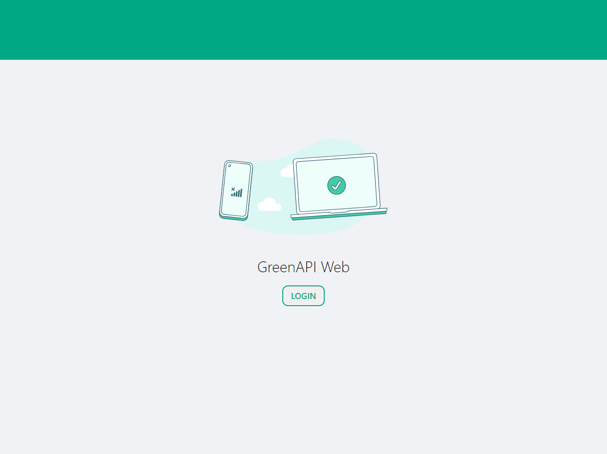
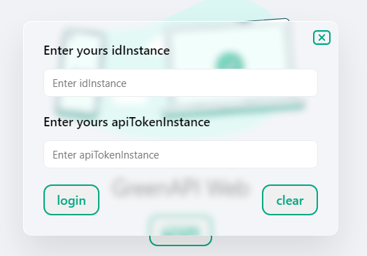
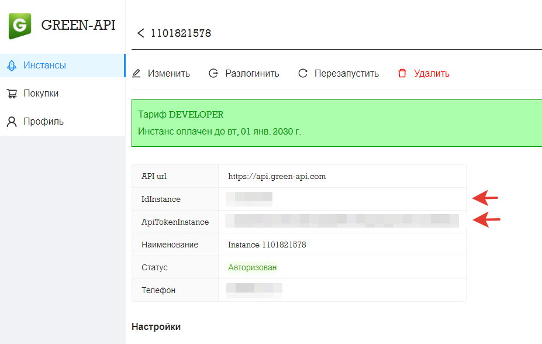
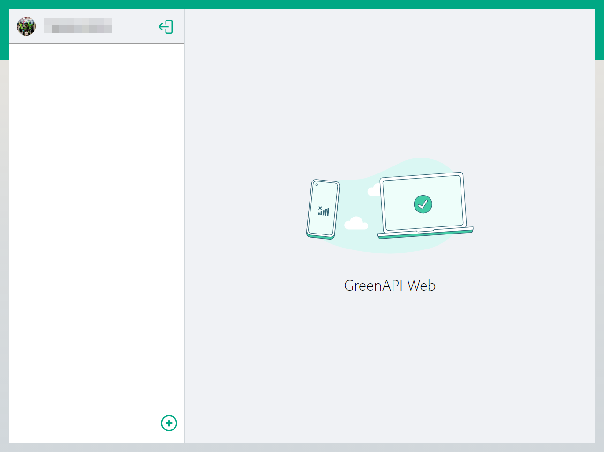
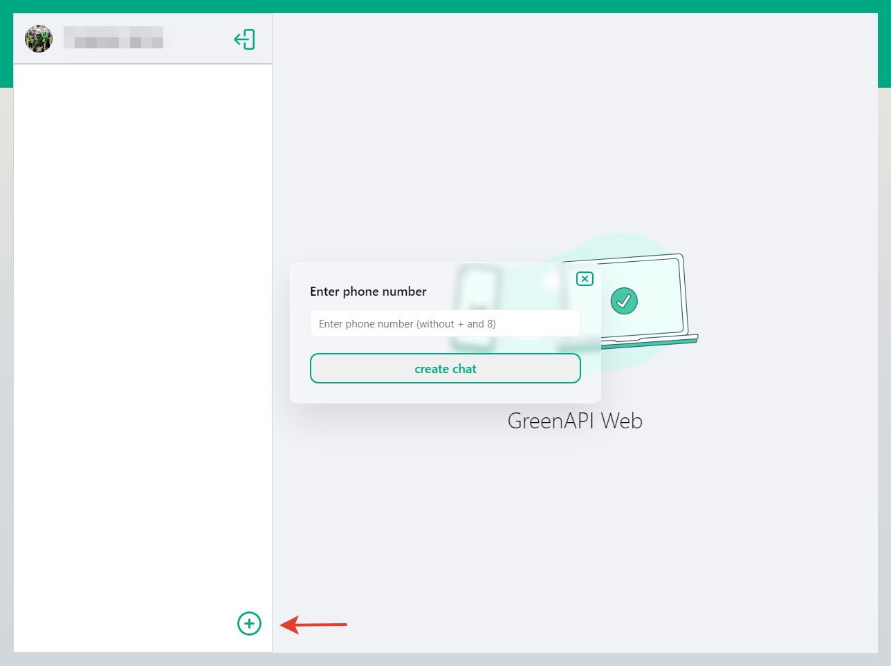
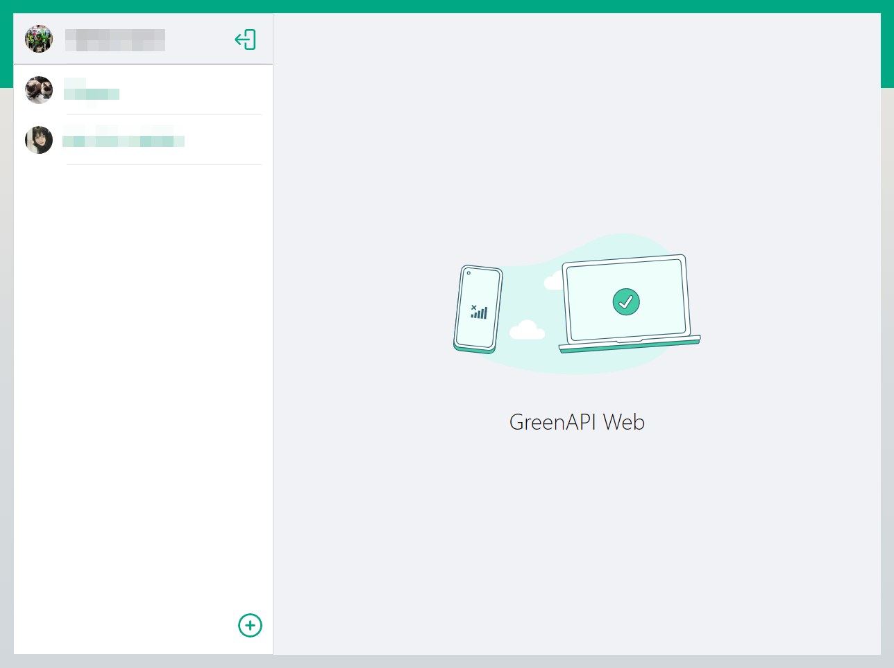
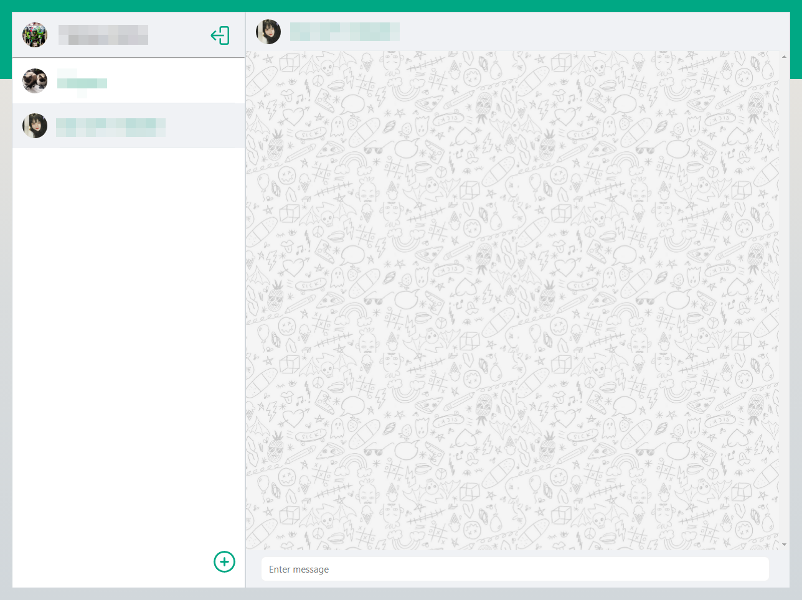
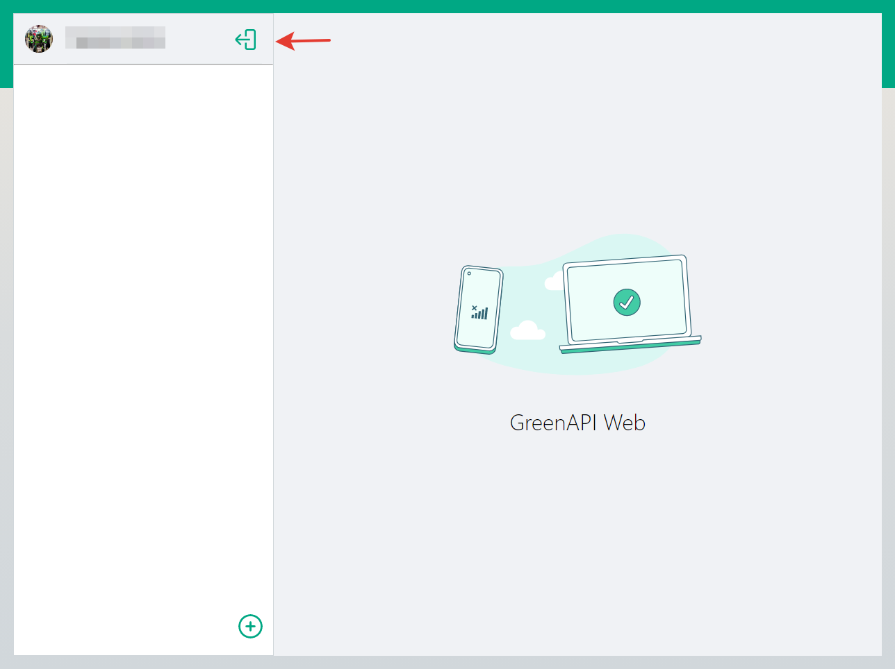

# Пользовательский интерфейс WhatsApp.

#### для отправки и получения сообщений.
* `deploy:` https://green-api-kappa.vercel.app/

---

#### Установка зависимостей:
```md
npm install
```

#### Запуск приложения:
```md
npm run start
```

---


## Инструкция с картинками
#### которую никто никогда не читает 😄
+ Регистрация в сервисе [GREEN API](https://green-api.com/index.html) воспользоваться [документацией](https://green-api.com/docs/before-start/) и(или) видео [инструкциями](https://www.youtube.com/@green-api/videos)

 

+ Для интеграции с сервисом [GREEN API](https://green-api.com/index.html) необходимо ввести идентификаторы   




+ Идентификаторы можно узнать в личном кабинете после регистрации     

    

+ Успешная регистрация

  

+ Добавить номер контакта для обмена сообщениями     
    * `Телефон следует указывать полностью, с кодом страны без пробелов и занаков "+" ` 
  



+ После добавления контакты отображаются в левой части     



+ Для отправки сообщений выберите контакт кликом     



+ #### Внимание !!!
    * Идентификаторы и id чатов сохраняются в Local Storage, для удаления необходимо "разлогиниться"      
    
    


---

## Технологии
- React, Redux-toolkit
- Git, GitHub
- Axios
- Сервис API - [GREEN API](https://green-api.com/index.html)
- Sass

---

[](https://forthebadge.com)
